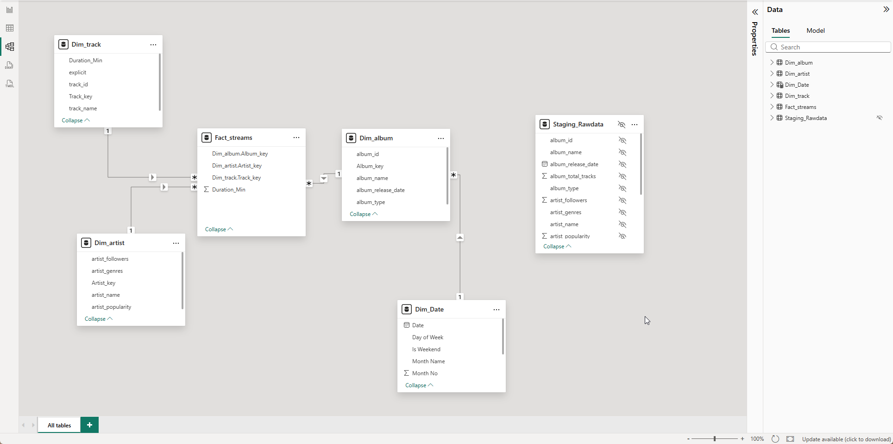

# Spotify Data Warehouse Solution 🎵

## 📖 Context
This project was created as a solution for a user on Discord who needed help transforming raw Spotify data into a workable Power BI model. 

The original dataset contained unstructured tables with mixed dates and redundant text columns, making analysis difficult. My goal was to demonstrate how to convert this into a clean, industry-standard **Star Schema** for better performance and easier reporting.

## 📂 Data Source & Credit
* **Original Data & Challenge:** [NitinNSB/Spotify-Data-Warehouse](https://github.com/NitinNSB/Spotify-Data-Warehouse)
* **Solution Author:** [notmudge](https://github.com/notmudge)

## 🛠️ What I Did
To solve the data modeling challenges, I performed the following steps:

* **I transformed the raw data into a Star Schema**, separating the flat files into a central Fact table (`Fact_streams`) and three dedicated Dimension tables (`Dim_artist`, `Dim_album`, `Dim_track`).
* **I optimized the model's performance** by merging tables to replace heavy text columns (like Artist Name) with lightweight **Numeric Keys**, reducing the file size and improving filter speed.
* **I solved the "Date Error" issue** by cleaning the mixed-format dates (e.g., handling "1981-12") and creating a standard **Date Table** using DAX.
* **I pivoted the analysis strategy**: Since the dataset lacked a specific "Time Played" timestamp, I linked the Date Table to `Dim_album` to allow for **"Musical Era" analysis** (analyzing library composition by Release Year) instead of Time-of-Day analysis.
* **I finalized the model** by validating all relationships as **One-to-Many (1:*)** and hiding the raw staging tables to ensure the report view is clean for end-users.

## 📊 The Data Model (Star Schema)
Here is the final Snowflake/Star schema architecture designed for this solution:

## 🚀 How to Use This File
1.  **Download** the `.pbix` file from this repository.
2.  Open it in **Power BI Desktop**.
3.  Explore the **Model View** to see the relationships between `Fact_streams` and the Dimensions.
4.  Check the **Power Query Editor** to see the "Transformation Steps" applied to clean the dates.

---
*If you found this solution helpful, please verify the original data source linked above!*
